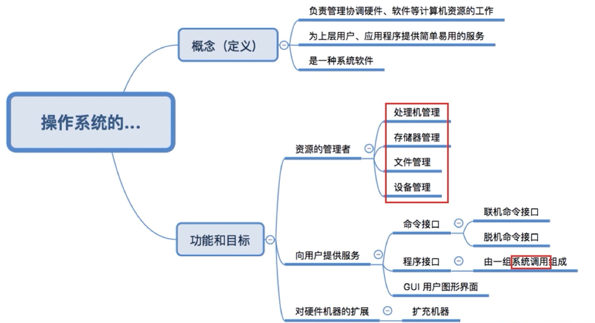
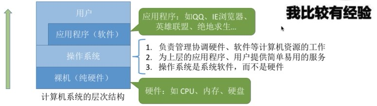
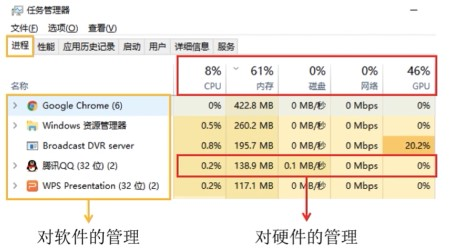
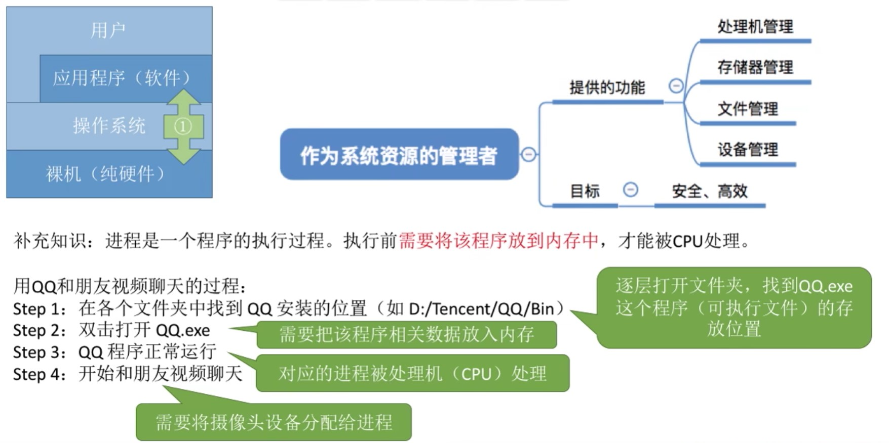
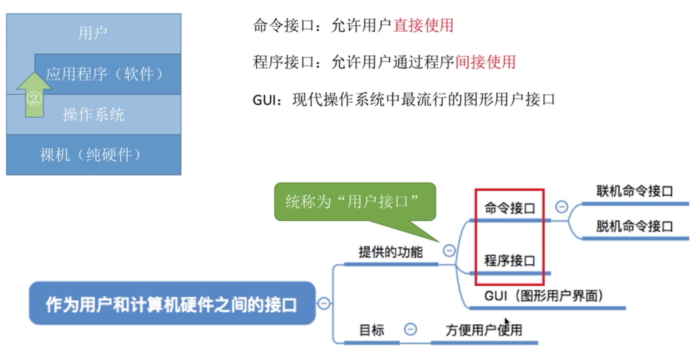
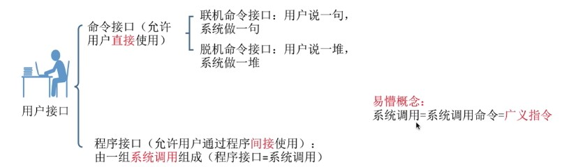
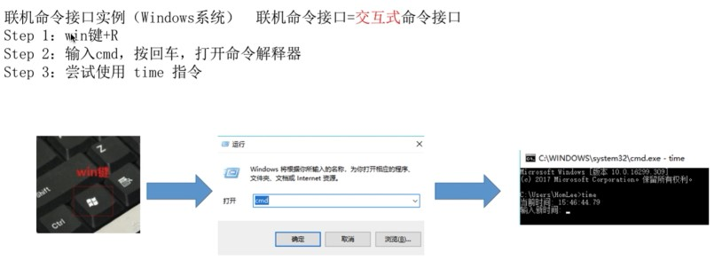
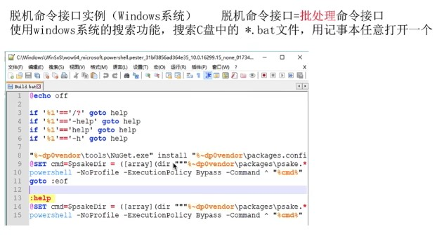
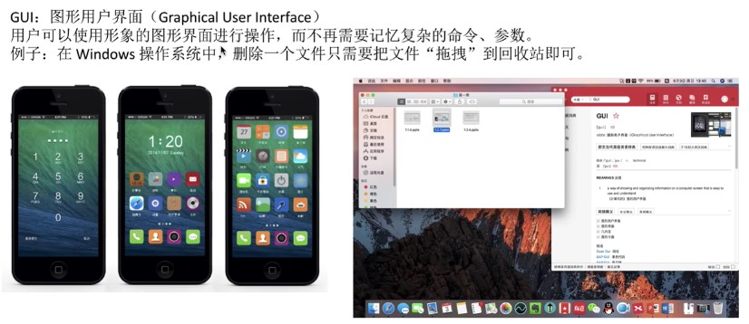
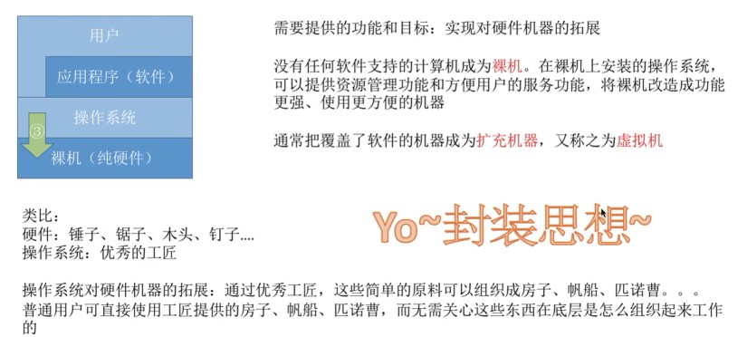

# 1.1_1_操作系统的概念、功能和目标

## 定义

操作系统（Operating System, OS)是指

- 从中间往上下看：控制和管理计算机系统的硬件和软件资源，并合理地组织调用计算机的工作和资源的分配
- 从下往上看：以提供给用户和其他软件方便的接口和环境
- 从上往下看：它是计算机系统中最基本的系统软件

## 功能和目标

### **作为系统资源的管理者**

### **作为用户和计算机硬件之间的接口**

### **作为最接近硬件的层次**

